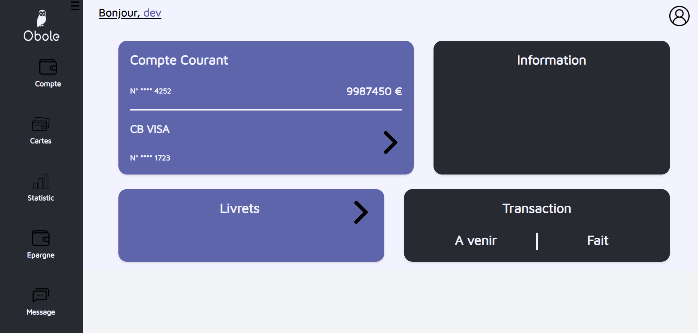

# Obole Bank

## About the Developers

Hi, we are Colas and Axel, the developers of this project. We are passionate software engineers with a focus on web development. We have experience in building interactive and user-friendly web applications. Connect with us on [LinkedIn](https://www.linkedin.com/in/colasrenard) and [LinkedIn](https://www.linkedin.com/in/axelvalentin) to know more about our professional backgrounds. You can also find us on [Twitter](https://twitter.com/) and [Twitter](https://twitter.com/) for updates and discussions related to programming.

## Project Description

Obole Bank is an online banking platform developed by a team of two in just two months as our final project at Holberton. This cutting-edge application, built using the MERN stack (MongoDB, Express.js, React, and Node.js)

https://obole.vercel.app/login

## Story of Development

The journey of developing Obole Bank began with the vision of creating a modern banking platform that addresses the pain points of traditional banking systems. As developers, we aimed to deliver a user-centric experience with a focus on simplicity and convenience.

Throughout the development process, we encountered various challenges. One of the major challenges was implementing a secure authentication system to protect user accounts and data. We invested significant time and effort in implementing industry-standard security measures, such as encryption SHA-256, and following best practices for secure coding.

Despite these challenges, we have successfully implemented several features, including:

- User account management
- Fund transfers between accounts
- Transaction history and statement generation
- Budget tracking and expense categorization

While we are proud of the progress we have made, Obole Bank is still under active development, and there are several features that we plan to implement, such as:

- Integration with third-party financial services
- Advanced data analytics and insights
- Mobile application support
- Enhanced security features

We are excited about the future of Obole Bank and are committed to continuously improving and expanding its features to provide the best banking experience for our users.

## Installation and Usage

To run Obole Bank locally, follow these steps:

1. Clone the repository: `git clone git@github.com:Pixeloceax/Obole.git`
2. Install the dependencies: `npm install`
3. Set up the environment variables.
4. Start the development server: `npm start`
5. Start the backend server: `npm run dev`
6. Open your browser and navigate to `http://localhost:3000`

Make sure you have MongoDB installed and running locally or configure the connection to a remote MongoDB server in the environment variables.

## Feedback and Contributions

We welcome any feedback, suggestions, or contributions to improve Obole Bank. If you encounter any issues or have ideas for new features, please open an issue on our GitHub repository. You can also reach out to us directly through our LinkedIn profiles or Twitter accounts mentioned above.
